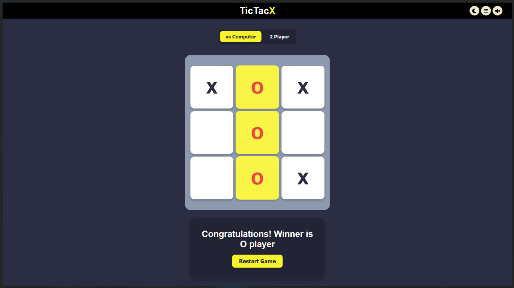
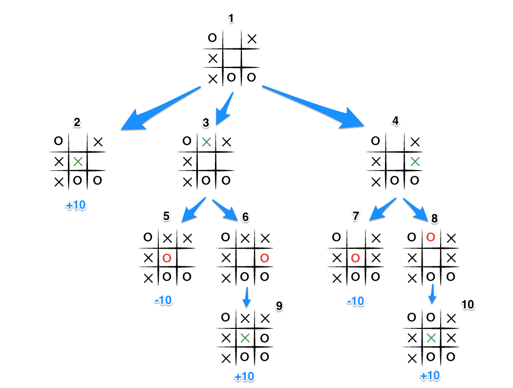
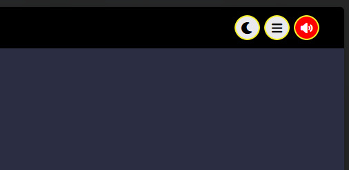
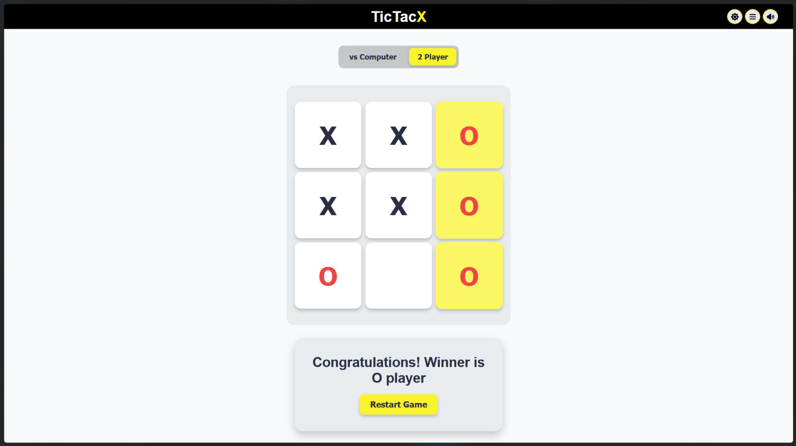
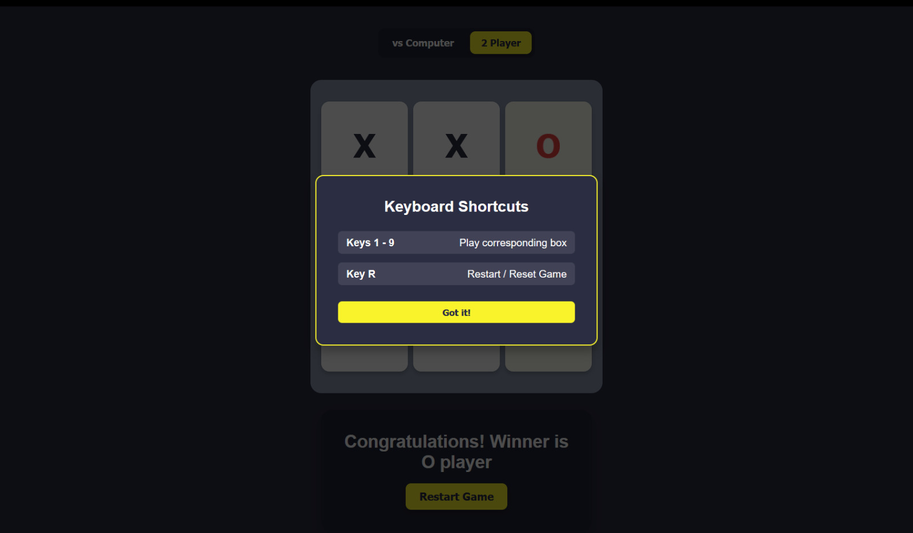
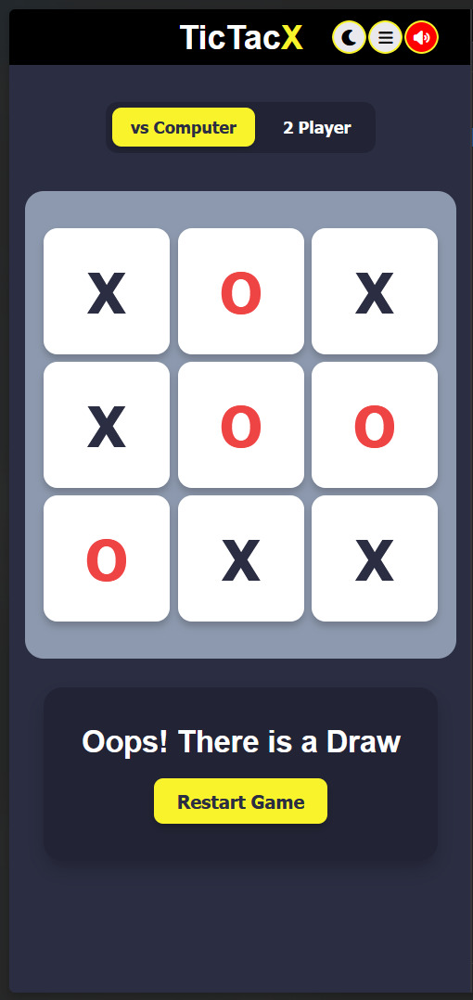

# TicTacX

TicTacX is a modern, feature-rich web version of the classic Tic-Tac-Toe game. Instead of a normal basic Tic-Tac-Toe, I have built a complete, polished project that includes advanced features, keyboard shortcuts, multi-mode gameplay, and an intelligent computer opponent.

**Live Demo:** [https://itsneeleshsingh.github.io/TicTacX/](https://itsneeleshsingh.github.io/TicTacX/)

---

## Features

* **Dual Game Modes:** Play against a friend locally (2 Player mode) or test your skills against the computer.
* **Smart AI (Minimax Algorithm):** The computer player uses the Minimax algorithm to think ahead and play the best possible moves so it never loses. I used this video for reference: [Minimax Tutorial Video](https://www.youtube.com/watch?v=5y2a0Zhgq0U).
* **Sound Effects & Mute Control:** Added custom sound effects for clicking boxes, winning, and drawing, along with a button to mute or unmute the sounds.
* **Dark & Light Themes:** Switch smoothly between dark mode and light mode depending on what you prefer.
* **Keyboard Accessibility:** You can use keys `1` through `9` on your keyboard to pick the matching box on the grid, and press `R` to restart or reset the game.
* **Animations & Popups:** Features smooth animations like tiles popping in, victory boxes pulsing when someone wins, and a popup menu for keyboard shortcuts.

---

## How the Minimax AI Works

To make the computer smart instead of just picking random spots, I implemented the **Minimax algorithm**. 

Instead of guessing, the computer uses **recursion and backtracking** to look into the future:
1. **Simulating Moves:** The algorithm loops through every empty box on the board and pretends to place a computer move.
2. **Thinking Ahead (Recursion):** For every test move it makes, it then simulates what the human player would do next, repeating this process back and forth until the game reaches a win, loss, or tie.
3. **Backtracking:** Once it finishes checking a future scenario, it clears ("undoes") the test move from the board so it can test the next empty box safely.
4. **Scoring:** It gives points for a win, negative points for a loss, and zero for a draw. Because it wants to win, it always picks the path that leads to the highest score, making it unbeatable.

Note: Here I also used depth with the 10 points to make the computer win in as much less steps it can.

---

## Preview & UI Gallery

### Header Menu Controls
The header has quick action buttons so you can easily toggle themes, view the shortcut guide, and control the sound.

### Light Theme
A clean, bright light mode style.

### Keyboard Shortcuts Modal
A popup menu that shows you all the keyboard shortcuts you can use.

### Fully Responsive Mobile View
Designed to fit nicely on mobile screens without messing up the buttons or layout.

---

## SEO & Performance Optimization

To ensure the project is search-engine friendly and optimized for web visibility, standard SEO practices were integrated:
* **Meta Tags & Description:** Added descriptive meta tags (`description`, `keywords`, and `author`) in the HTML head so search crawlers can index the site accurately.
* **Open Graph Tags:** Included Open Graph social preview meta tags to ensure clean thumbnail and title formatting when shared across platforms like LinkedIn, Twitter, or WhatsApp.
* **Semantic HTML Structure:** Used proper semantic elements (`<header>`, `<main>`, `<h1>`) to improve accessibility and page indexing scores.

---

## Tech Stack

* **HTML5** for the page structure.
* **CSS3** for styling, flexbox layouts, and animations.
* **JavaScript** for game logic, sounds, theme switching, and the computer AI.
* **Font Awesome** for icons.

---

## License

This project is open source and available under the [MIT License](LICENSE).